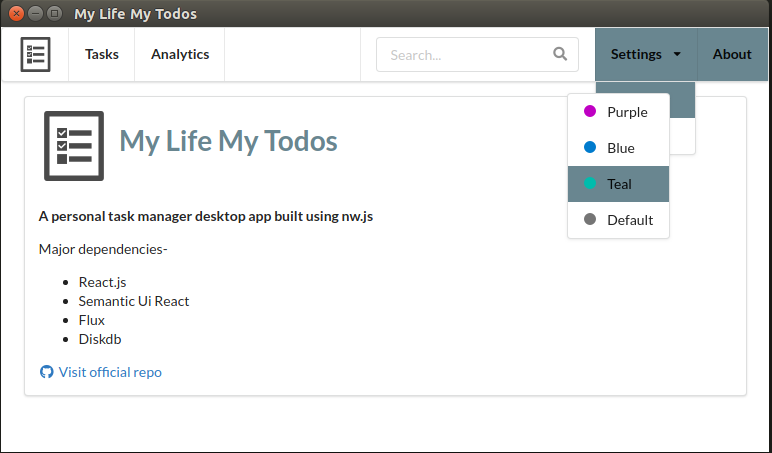

# my-life-my-todos
A todo (task management) desktop app built using node-webkit (nw.js), react.js, diskdb and semantic-ui-react.

### How to install

1. You must have nw.js installed. `sudo npm i -g nw --unsafe-perm=true --allow-root`
2. `git clone https://github.com/varunon9/my-life-my-todos.git`
3. `cd my-life-my-todos`
4. `npm install`
5. `nw .`

### Screenshots
|  |  |
| --- | --- |
| | |
| | |

##### Icon Credit
Icons made by [Freepik](http://www.freepik.com) from [Flaticon](https://www.flaticon.com/) is licensed by 
[Creative Commons BY 3.0](http://creativecommons.org/licenses/by/3.0/)

##### For query/issues create Github issue or contact: varunon9@gmail.com
